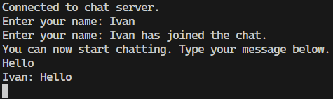

# Java Chat Application

## Overview

This is a simple multi-user chat application implemented in Java using socket programming. It allows multiple clients to connect to a central server, send messages, and receive messages from other users in real time.

## Features

- **Multi-client support**: Multiple users can connect to the server simultaneously.
- **Real-time messaging**: Clients can send and receive messages instantly.
- **User notifications**: Notifies all users when someone joins or leaves the chat.
- **Simple text-based interface**: Easy to use and interact with.

## Requirements

- Java 8 or later
- Terminal/Command Prompt
- Optional: Any IDE (e.g., IntelliJ IDEA, Eclipse, VS Code)

## File Structure

```
ChatApplication/
│── src/
│   ├── server/
│   │   ├── ChatServer.java  # Server-side implementation
│   ├── client/
│   │   ├── ChatClient.java  # Client-side implementation
│── README.md                # Instructions and documentation
```

## How to Run the Chat Application

### 1. Start the Server

First, navigate to the server directory and compile `ChatServer.java`:

```sh
javac -d out/ src/server/ChatServer.java
```

Run the server:

```sh
java -cp out/ server.ChatServer
```

The server will start and listen for incoming client connections.

### 2. Start the Client

In a new terminal, navigate to the client directory and compile `ChatClient.java`:

```sh
javac -d out/ src/client/ChatClient.java
```

Run the client:

```sh
java -cp out/ client.ChatClient
```

You can start multiple clients to join the chat.

## Example Chat Session

```
Enter your name: John
You can now start chatting. Type your message below.
John: Hello everyone!
Alice has joined the chat.
Alice: Hi John!
```

## Troubleshooting

- **Client does not connect to the server**:

  - Ensure the server is running before starting a client.
  - Check that the client is connecting to the correct IP and port (`localhost:12345`).

- **Messages are not being received**:

  - Verify that messages are being broadcasted in `ChatServer.java`.
  - Ensure the client is continuously reading messages.

- **Port already in use error**:

  - If you see an error like `Address already in use: JVM_Bind`, ensure no other process is using port `12345`.
  - Try changing the port in `ChatServer.java` and `ChatClient.java`.

## Screenshots



## License

This project is free to use for educational purposes.

---

This guide provides everything needed to run and troubleshoot the Java chat application. Let me know if you need any modifications! 🚀
